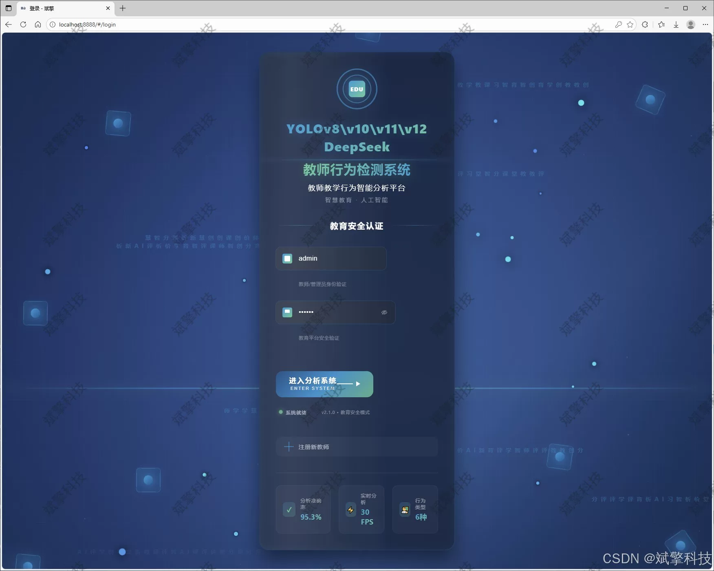
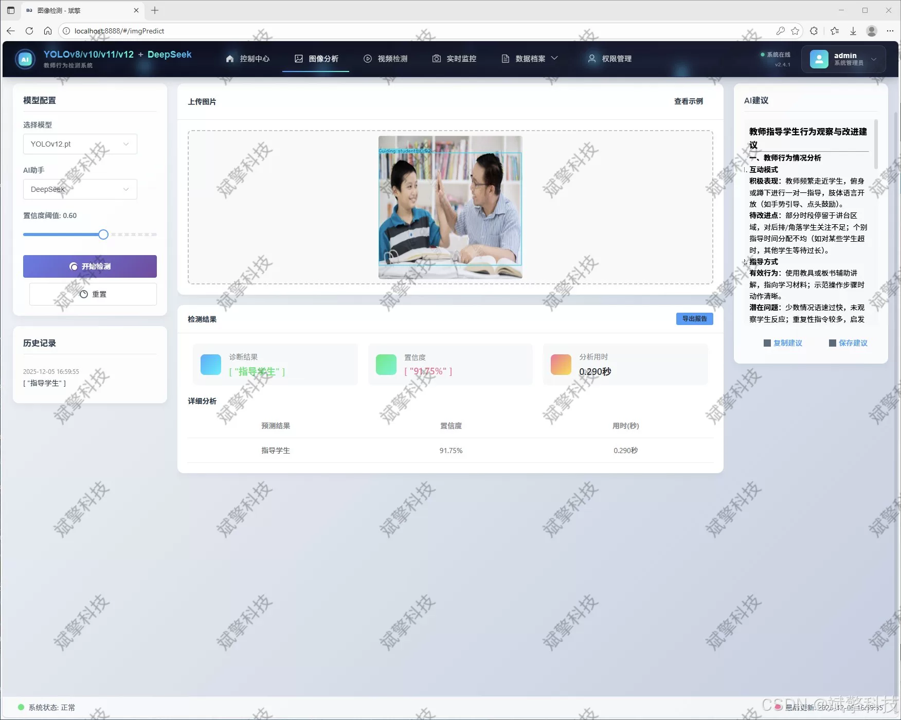
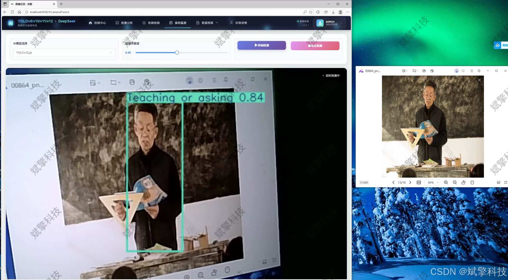
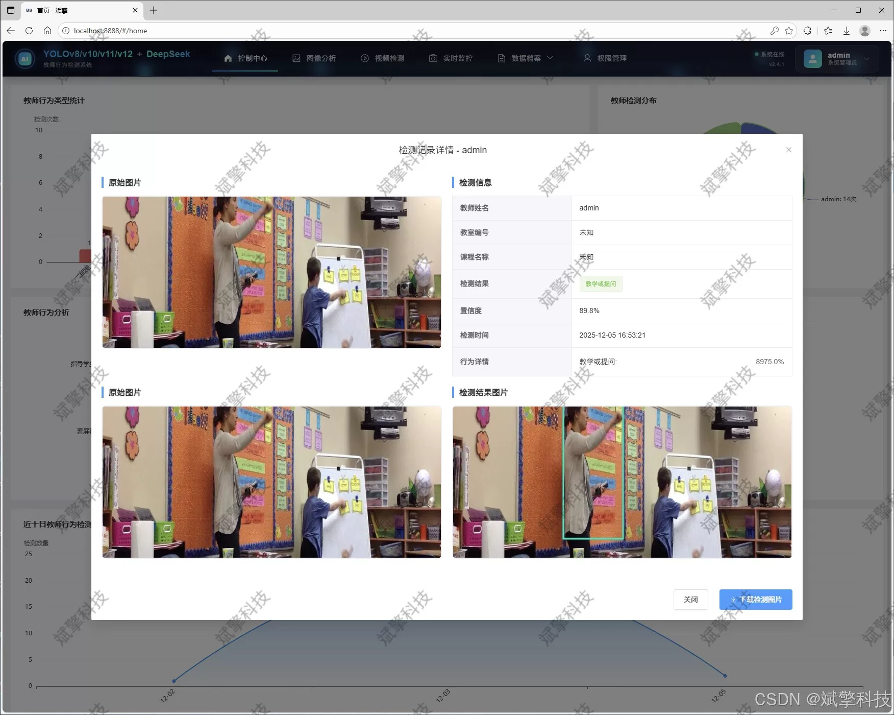
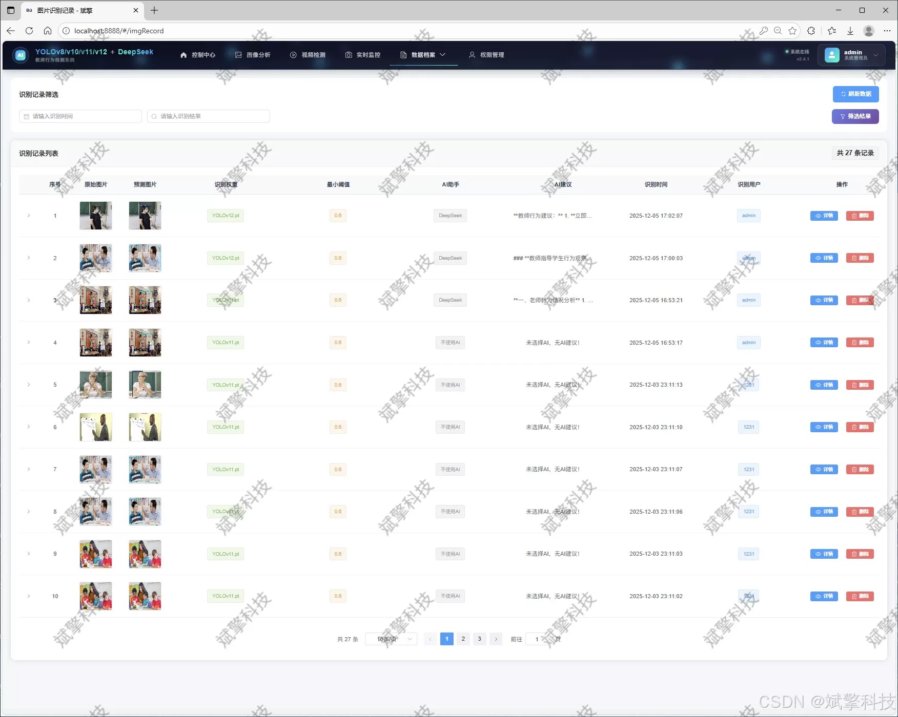
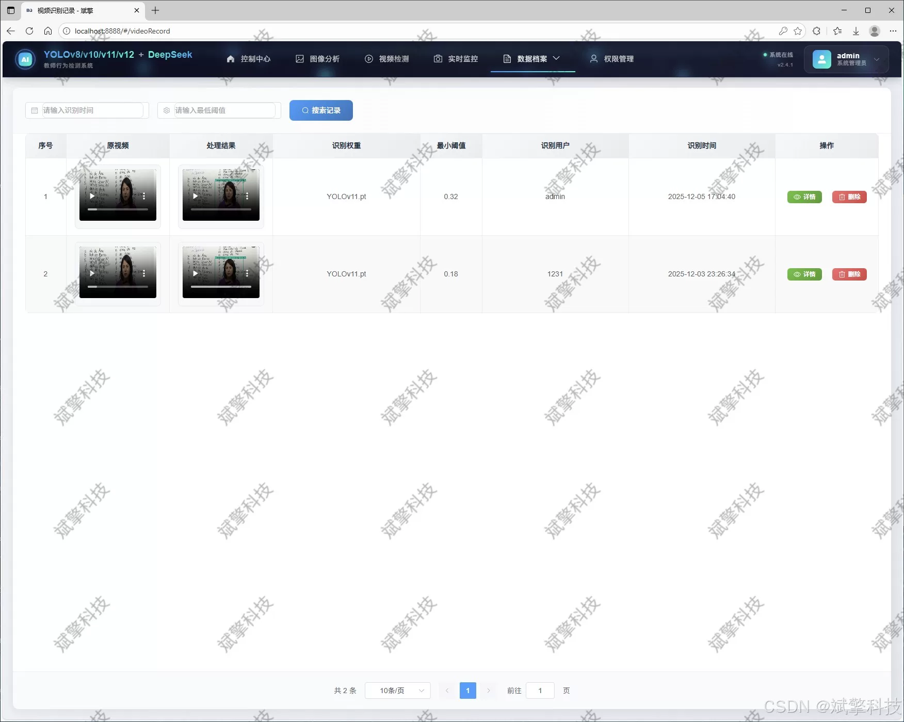
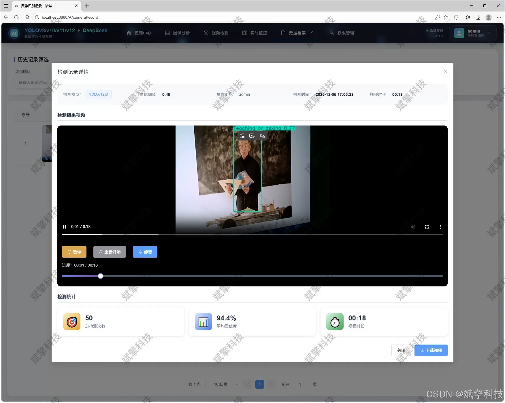
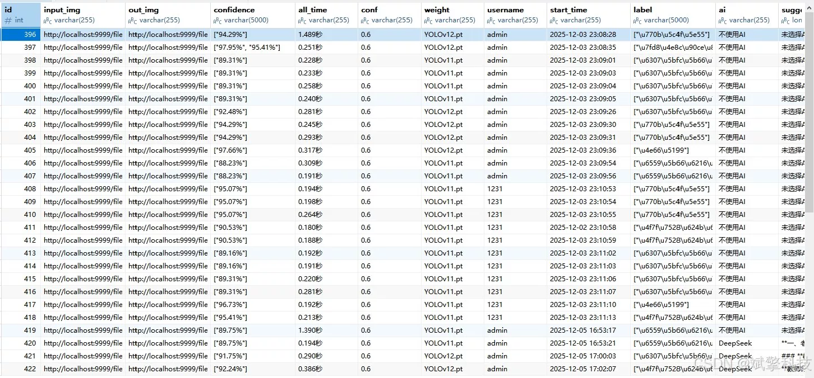

# Based on YOLO deep learning and the big models of Qianwen and DeepSeek, the teacher's classroom

## Body

Based on YOLO deep learning and the large models of Qianwen, DeepSeek's teacher classroom behavior recognition detection system (DeepSeek intelligent analysis + web interface + front-end separation + YOLO data + YOLOv8/YOLOv10/YOLOv11/YOLOv12)

This project introduces a comprehensive teacher classroom behavior recognition and analysis system that integrates the latest computer vision technology with modern Web development frameworks. The system aims to automatically recognize and record key behavior patterns of teachers in classroom teaching through non-intrusive means, providing objective and quantitative data support for teaching evaluation, teacher professional development, and educational research. The core of the system is based on YOLOv8 as a benchmark and compatible with the cutting-edge YOLOv12 series models, ensuring high accuracy and real-time recognition of six typical classroom behaviors such as "sitting on one leg", "instructing students", "looking at the screen", "lecturing/asking questions", "using mobile phones", and "writing". Innovatively, the system integrates the intelligent analysis function of the DeepSeek large language model, which can interpret and summarize the results at the semantic level, generating structured teaching behavior analysis reports. The system architecture adopts a front-end-backend separation model, with the backend based on the spring boot framework and the front end using Vue.js to build a responsive web interface. The database is selected for MySQL for structured data storage. The system has complete functional modules, including multimodal input source (images, videos, real-time cameras), multi-model switching, comprehensive data visualization, user and recognition record management, and personal center. Experiments show that the system performs well on a dataset of nearly ten thousand labeled images, with an average precision mean (mAP) over 95.9%, demonstrating good robustness and practicality, making it an effective tool for promoting smart classrooms and precise teaching research.

Functional modules

✅ Information visualization, data visualization.

✅ Image detection supported by AI analysis functions, DeepSeek and Qianwen.

✅ Support for image detection, video detection, and real-time camera detection, with detected results saved to MySQL database.

✅ Image recognition record management, video recognition record management, and camera recognition record management.

✅ User management module, allowing administrators to add, delete, update, and view users.

✅ Personal center, where users can modify their information, including passwords, names, and profile pictures.

## Images

## Payment

Here is a pay link on Stripe ( https://buy.stripe.com/3cs8yP7sY87d0vu9AB ). Please contact me lonlonago@foxmail.com after funding $89, and I will send you a complete data files , thank you!

